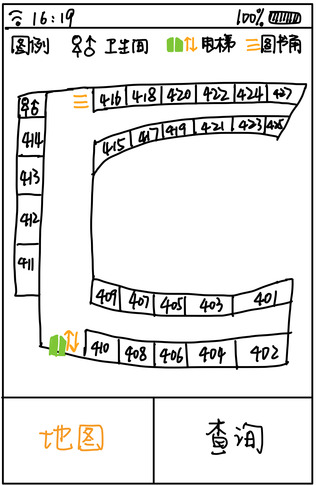
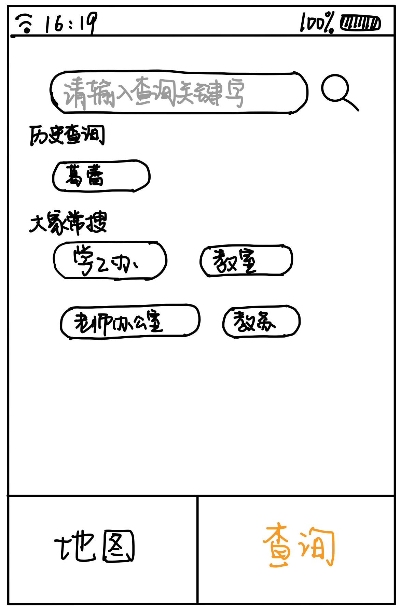
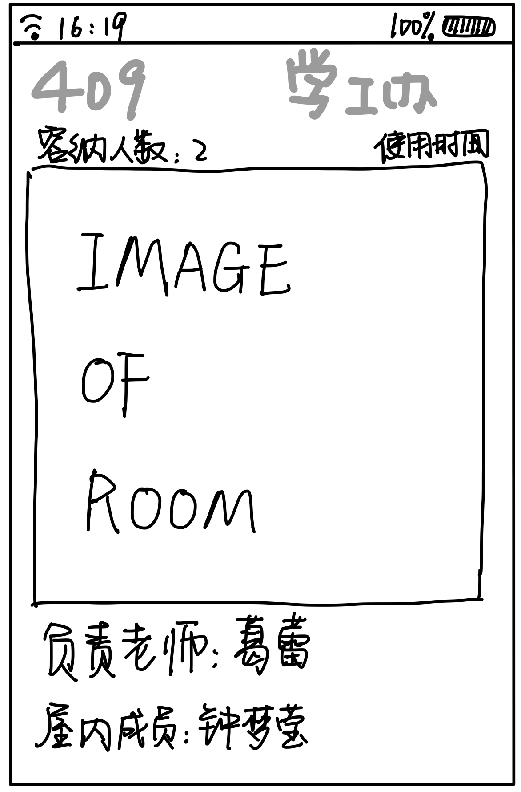
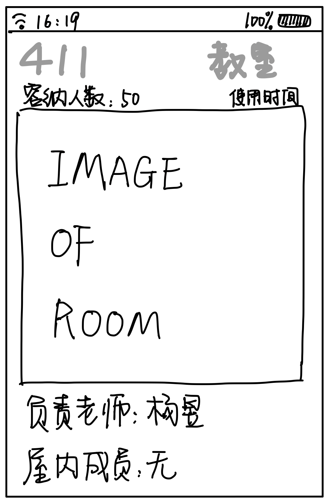
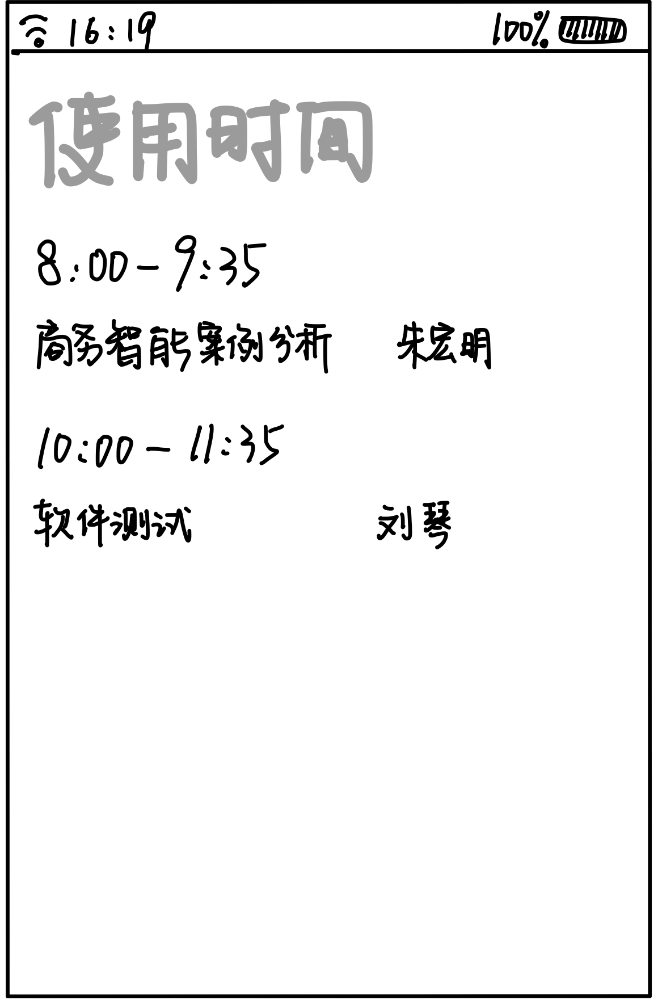

# Assignment 1

因为我们所做的是手机app，介于small display和电脑显示之间，所以我们需要对内容进行一些简化来符合“less is more”的设计原则

这里总共有两个功能，一个是地图，一个是查询。地图功能可以看到济事楼第四层的整体构造，并且可以通过房间上的数字点击查看房间的详细信息。同时，会对其中的特使信标进行图例的标注，比如卫生间、电梯、图书角等。

这里在下面的地图和查询部分采用了menu bars的导航栏方法，较为直观的体现了各个部分所代表的功能。

对于不同的房间而言有不同的用途，比如负责授课的教师，任课老师所在的办公室，教务老师所在的办公室等等。根据其用途或其他标志来看，其用途或其他标志组成了一个Long list，可以使用Tag clouds来进行区分和搜索。

这里同时存储了历史搜索，所谓一个Split menu存在于查询下面，这里可以存储3-4个历史搜索过的房间，方便使用软件的人进行历史的搜索。

可以从地图点击各个房间进行信息的查看或者通过搜索进入，每个房间会显示当前房间的房间号、用途、使用时间、容纳人数、房间图片、负责老师以及屋内成员。

对于教师办公室而言容纳人数为这个办公室的人数，使用时间为老师的上班时间。

对于教室而言容纳人数为教室的最大承载量，使用时间为当前教室有课的时间，需要借教室的同学可以根据这个数据来判断借教室的问题。

