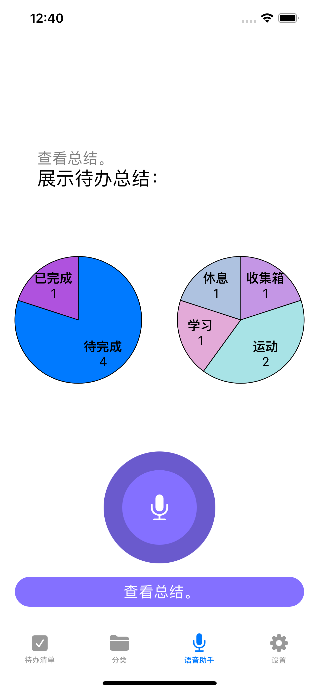

# Human Computer Interaction

## 1 Introduction

### 1.1 Brief Description

Our idea came from a book called "The Paradox of Choice", in which a revolutionary idea was presented that happiness means having freedom and choice, but more freedom and choice does not lead to greater happiness, instead, the more choices, the less happiness!
Many of us are in the habit of using To-Do List software, and these software usually allow users to choose the category of todo when creating a new todo, but according to the paradox of choice, this may bother users more, so we explored the possibility of using machine learning techniques to reduce the burden of user choice.

### 1.2 Structure

There are a total of _ modules in Intelli Todo. There are _.

The structure of the project is as follows:

\____

### 1.3 Development Environment

\___

## 2 Functionality

### 2.1 Manage To-do List

Users can add, modify and delete items in their own to-do lists

### 2.2 Intelligent Classification

For each item in the to-do list, the user can categorize it. When the existing categories do not meet the user's needs, the user can add their own categories.

For various todos, we have trained a text classifier that can predict the category of a todo based on its title, thus helping users to make classification choices and improving user experience. It is worth noting that we use the On-device model personalization technique, which means that our model is not fixed after training, but supports local personalized learning, because each user creates a different category in the todo list software and has different classification habits, and we learn the classification habits of users by personalizing them. We can greatly improve the user experience by personalized learning of users' categorization habits.

We can make a choice about On-device model personalization and choose whether to use this technique for training our classification.

### 2.3 Speech Recognition

We support voice assistant function, users can operate Todo List by voice recognition method, in this interface we reflect the state of the user's voice more clearly through the change of the breathing light, the breathing light will not move in the non-recording state, the breathing light will move slowly in the recording state, the breathing light will move faster when the user is talking, thus enhancing the interactivity.

We can also use speech recognition to do some visualization of the data in our to-do list, and you can see here the relationship between our completed to-do list and our unfinished to-do list, as well as a pie chart showing the percentage of all to-do lists in different categories.

## 3 Advantages & Disadvantages

### 3.1 Advantages

We use machine learning techniques to reduce the burden of user selection, so that users can create a new todo without having to select categories.

The use of voice recognition technology also frees up the user's hands and makes the program easier to use.

The visualization of the to-do situation also makes it easier for the user to summarize the to-do list and organize the next tasks.

### 3.2 Disadvantages

The program may have users from different countries, and language conversions are not available in our program, which may make the program difficult to use for some users.

For users, to-do integration of screen usage time, steps, or sleep might make the program easier to use, but our program doesn't implement this feature right now.

## 4 Improvement

Our program can later add a language module, so that users can make principles for the language, which will not only make it easy for foreign users to use our program, but also to promote our app to the world market.

Next we will integrate the sleep module provided by iOS in the sleep category and the step count module provided by iOS in the exercise category, etc. This will allow users to see more intuitively the results achieved by each category.
