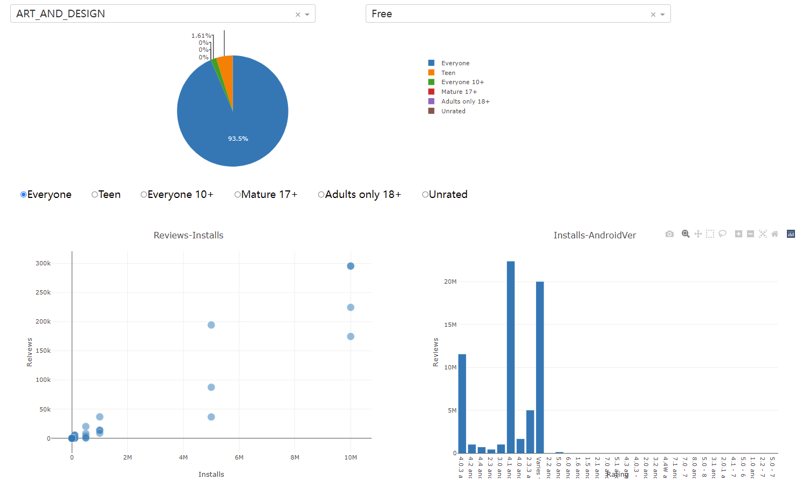
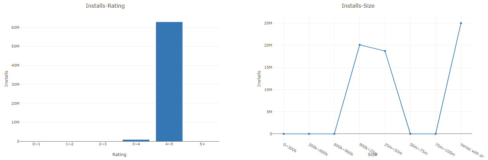
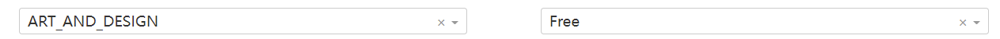
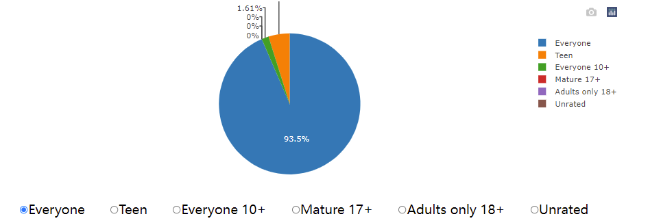
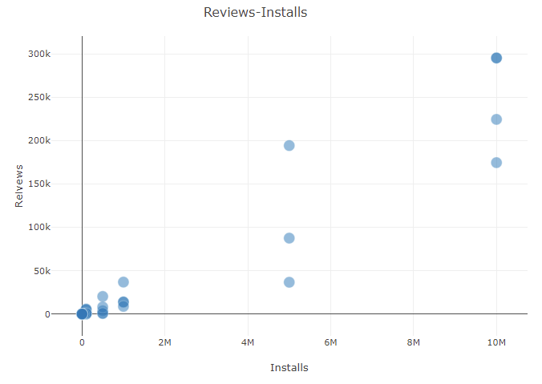
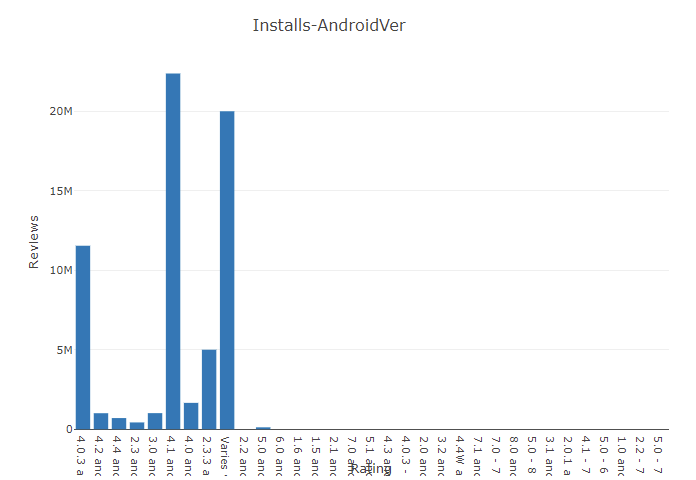
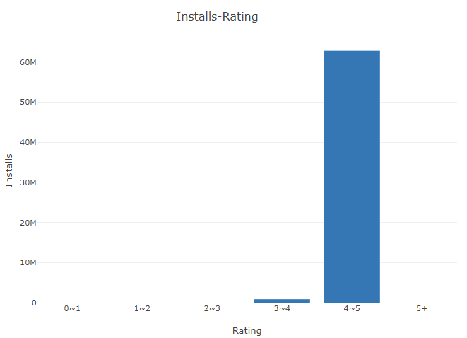
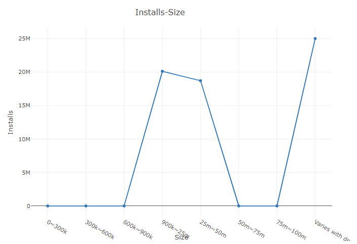

# Lab 3: Data Visualization

This project visualize the data of google play store apps to drive app-making businesses to success.

## Installation

install conda environment

```
conda env create -f visible.yaml
conda activate visible
```

## Run

```
python dashboard.py 
```

## Requirements

 Design and implement a Dashboard for one of three datasets

 The dashboard should contain at least three graphs (e.g. scatter plot, bar chart, pie chart, line chart, etc) which reveal certain information respectively

## Project Structure

```
│  .gitignore
│  dashboard.py
│  README.md
│  visible.yaml
│
├─data
│      googleplaystore.csv
│
└─img
```

## Dataset

The project choose Google Play Store Apps as dataset.

The data includes:

- App: The name of app
- Category: The category of the app
- Rating: User rating of the app
- Reviews: The review of app
- Installs: Number of app downloads
- Type: Free or Paid
- Price: The price of app
- Content Rating: Who the app is for
- Genres: Genres of app
- Last Update: The date of last update
- Current Version: The current version of app
- Android Ver: Android version of the app adaptation

## Dash Board

- Overview





- Category and Type

  

- Target group of the corresponding catalog

  

- Apps' reviews and installs(With specific category / type / target group)

  

- Installations of different Android version(With specific category / type / target group)

  

- Installations of different rates(With specific category / type / target group)

  

- Installations of different app sizes(With specific category / type / target group)

  
